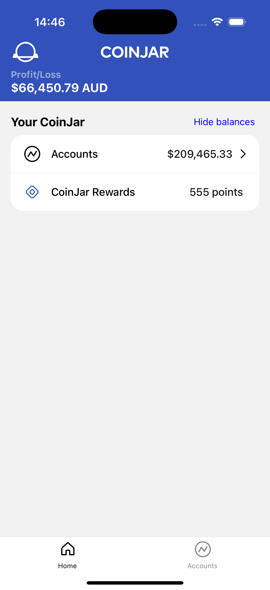
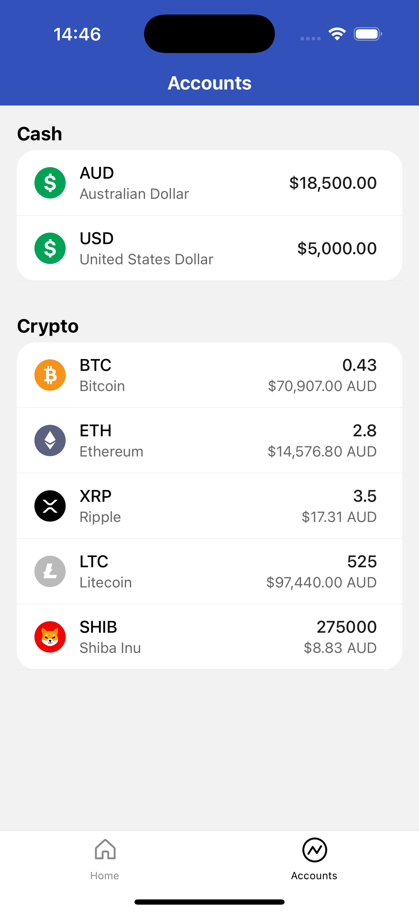

# Mini Crypto Exchange

A mini crypto exchange built using React Native, Typescript, and Relay.

<div display="inline">
  
  
</div>

## Getting Started

### 0. Prerequisites

- [Yarn](https://yarnpkg.com/getting-started/install)
- [React Native Environment Setup](https://reactnative.dev/docs/set-up-your-environment)
- [Xcode](https://developer.apple.com/xcode/)

> [!NOTE]
> You can skip any setup for Android as we are only focusing on the iOS simulator.

### 1. Clone the repository

```bash
git clone git@github.com:ellisjas/mini-crypto-exchange.git
cd mini-crypto-exchange
```

### 2. Set up the server

Navigate into the `server` directory:

```bash
cd server
```

Install dependencies:

```bash
yarn
```

Start the server:

```bash
yarn start
```

### 3. Set up the client

Navigate into the `app` directory:

```bash
cd app
```

Install dependencies:

```bash
yarn
```

Start Relay compiler in watch mode:

```bash
yarn relay-watch
```

### 4. Start the ios simulator

From within the `app` directory:

```bash
yarn ios
```
